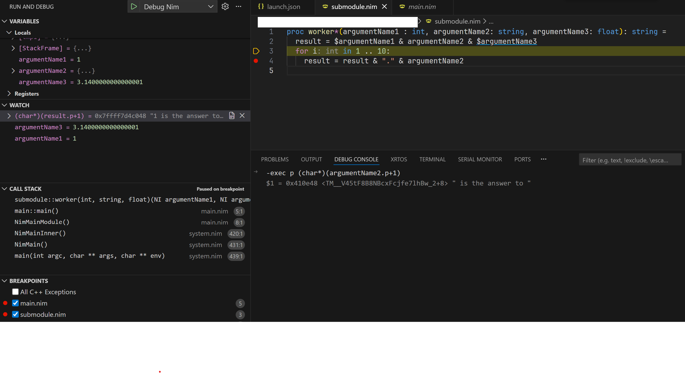

# nim-debugger-mi

A GDB/MI proxy for Nim that provides transparent symbol mangling/demangling for a better debugging experience in IDEs.

## Features

- **Transparent Symbol Translation**: Automatically demangles Nim symbols in GDB output and mangles user input
- **Function Name Demangling**: Shows readable function names in call stacks (both Nim and C++ styles)
- **Internal Variable Renaming**: Displays compiler-generated variables with readable names
- **Native Debugging**: Works with standard GDB/LLDB(#TBA) through the MI protocol
- **VSCode Integration**: Seamless integration with VSCode's native debugger
- **WINDOWS IS NOT SUPPORTED**: That is a feature

## Installation

```bash
nimble install nim_debugger_mi
```

## 


## Usage

### With VSCode

Install the ["Nim Debugger"](https://marketplace.visualstudio.com/items?itemName=YesDrX.nim-debugger) VSCode extension for automatic configuration, or manually configure your `launch.json`:

#### Linux/WSL
```json
{
    "name": "Debug Nim",
    "type": "cppdbg",
    "request": "launch",
    "program": "${workspaceFolder}/${fileBasenameNoExtension}",
    "miDebuggerPath": "${userHome}/.nimble/bin/nim_debugger_mi",
    "miDebuggerArgs": "", // you may specify gdb path by --gdb-path=/path/to/your/gdb
    "MIMode": "gdb",
    "args": [],
    "cwd": "${workspaceFolder}"
}
```

#### Mac (Apple Silicon)
```json
{
    "name": "Debug Nim",
    "type": "cppdbg",
    "request": "launch",
    "program": "${workspaceFolder}/${fileBasenameNoExtension}",
    "miDebuggerPath": "${userHome}/.nimble/bin/nim_debugger_mi",
    "miDebuggerArgs": "--lldb", //if --lldb is specified, it will try to load lldb-mi from ms-vscode.cpptools; you may specify --lldb-path as well
    "MIMode": "lldb",
    "args": [],
    "cwd": "${workspaceFolder}"
}
```

### Windows (MingW)
```json

```


before starting debugging, you should build your binary with debuginfo:
```bash
nim c --debuginfo -d:debug --debugger:native ./src/main.nim
```


## How It Works

The proxy sits between your IDE and GDB, transforming symbols bidirectionally:

**Output (GDB → IDE):**
- `localVar_1` → `localVar`
- `_ZN4test4mainE` → `test::main`
- `T5_` → `[tmp5]`

**Input (IDE → GDB):**
- `localVar` → `localVar_1`
- `[tmp5]` → `T5_`

## Building from Source

```bash
git clone https://github.com/yesdrx/nim-debugger-mi
cd nim-debugger-mi
nimble build
```

## Requirements

- Nim >= 1.6.0
- GDB or LLDB
- C compiler (for custom process management)

## License

MIT License - see LICENSE file for details

## Author

yesdrx
